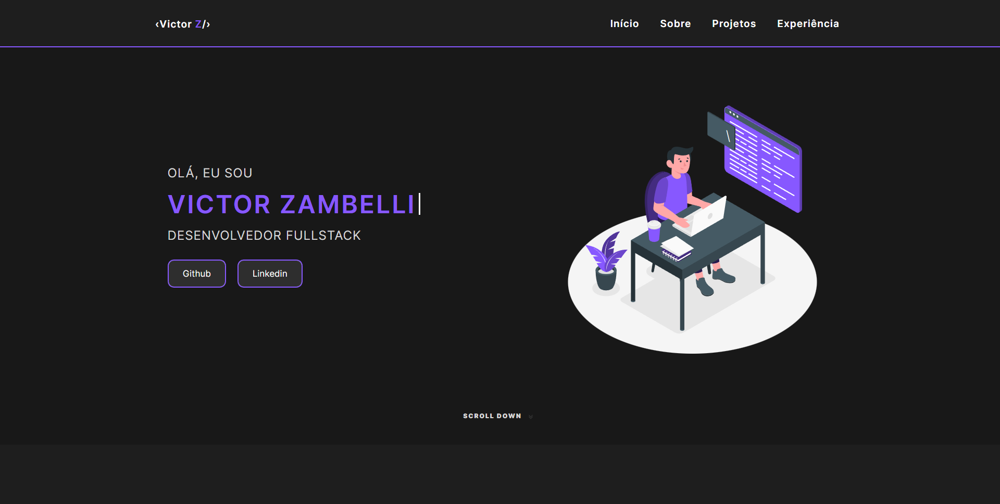

# Portfolio
I developed this portfolio to store my projects

## 🚀 Technologies
This project was developed with the following technologies:
- HTML
- CSS
- JSON
- TypeScript
- React
- Vite
- Tailwind
- Git & Github
- And others...

## 📚 Libraries
- [TypeScript](https://www.typescriptlang.org/docs/)
- [React](https://react.dev/reference/react)
- [Vite](https://vite.dev/guide/)
- [Tailwind](https://tailwindcss.com/docs/installation/using-vite)
- [JavaScript](https://developer.mozilla.org/pt-BR/docs/Web/JavaScript)
- [Font Awesome](https://fontawesome.com/)
- [Git](https://git-scm.com/doc)
- [DevIcon](https://devicon.dev/)

## 💻 Project

[Click here to access project](https://victorzambelli.github.io/victor-portfolio/)
> **Objetivo:** Create a portfolio to place my developed projects and talk about myself.
